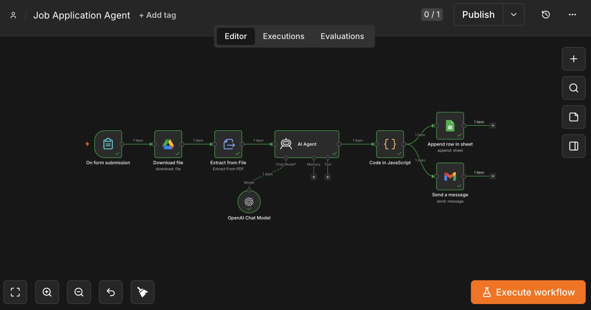

# Job Application Agent

An n8n workflow that automates the repetitive parts of applying for jobs: it reads a job description, compares it against my resume, generates a tailored cover letter and selection criteria responses, logs the application to a tracking spreadsheet, and emails me a summary — all from a single form submission.



## Why I built it

Applying for roles individually means re-reading each job ad, figuring out how my experience maps to it, and writing a tailored cover letter from scratch every time. This workflow handles the repetitive analysis and first-draft writing so I can focus on reviewing and personalizing the output, rather than starting from a blank page each time.

## What it does

1. **Intake** — A form captures the job title, company name, full job description, and job URL.
2. **Resume retrieval** — Pulls my resume from Google Drive and extracts the text from the PDF.
3. **Analysis & generation** — An AI agent (GPT-4o-mini) compares the resume against the job description and generates:
   - A match score out of 10
   - A tailored 3–4 paragraph cover letter
   - Responses to any selection criteria found in the job description
   - 3–5 specific resume improvement suggestions for that role
4. **Parsing** — A code node cleans and parses the model's JSON output into structured fields.
5. **Logging** — Appends a row to a Google Sheet tracking every application (date, company, role, URL, match score, cover letter, status).
6. **Notification** — Sends a formatted email summary so I have everything in one place to review before submitting.

## Architecture

```
Form submission
      │
      ▼
Download resume (Google Drive)
      │
      ▼
Extract text from PDF
      │
      ▼
AI Agent (GPT-4o-mini) ── analyzes fit, drafts cover letter,
      │                    answers selection criteria, suggests
      │                    resume tweaks
      ▼
Parse JSON output (Code node)
      │
      ├──▶ Append row to Google Sheet (tracking)
      │
      └──▶ Send summary email (Gmail)
```

## Key technical decisions

- **Single form trigger, no manual data entry** — all I provide is the job title, company, description, and URL; everything else is derived automatically.
- **Structured JSON output from the LLM** — the system prompt forces a strict JSON schema (`match_score`, `cover_letter`, `selection_criteria`, `resume_tips`), which keeps downstream nodes simple and avoids fragile text parsing.
- **Defensive JSON cleanup** — the model occasionally wraps its output in markdown code fences, so the Code node strips those before parsing to avoid execution errors.
- **Two outputs from one generation step** — the same parsed output branches into both a spreadsheet log (for tracking application history) and an email (for review), instead of duplicating the AI call.

## Stack

- [n8n](https://n8n.io) (workflow orchestration)
- OpenAI GPT-4o-mini (via LangChain agent node)
- Google Drive, Google Sheets, Gmail (via OAuth)

## Running it yourself

The exported workflow (`workflow.json`) has all personal identifiers and credential references replaced with placeholders. To run it:

1. Import `workflow.json` into your own n8n instance.
2. Connect your own Google Drive, Google Sheets, Gmail, and OpenAI credentials.
3. Update the resume file reference, target spreadsheet, and email address to your own.
4. Paste your resume text into the system prompt (or adjust the workflow to pull it dynamically from the extracted file content).

## Status

Working end-to-end for personal use; built as a practical tool and as a portfolio piece demonstrating workflow automation, API integration, and structured LLM output handling.
